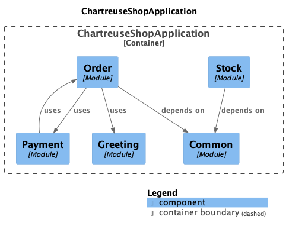

# A la découverte de Spring Modulith

## Prérequis

Afin de jouer cet atelier, assurez vous d'avoir sur votre poste :
- Java 17
- Docker Compose

## Exercice 1

Résolvez la dépendance cyclique Order <-> Payment

<details>
  <summary>Besoin d'aide ?</summary>
  
  Si vous essayez de lancer l'application à l'aide de la commande `./gradlew bootRun`, vous constaterez que l'application ne démarre pas :
  
  ```
  ***************************
  APPLICATION FAILED TO START
  ***************************
  
  Description:
  
  The dependencies of some of the beans in the application context form a cycle:
  
  orderController defined in file [./spring-modulith-workshop/build/classes/java/main/org/snowcamp/university/springmodulith/order/api/web/OrderController.class]
  ┌─────┐
  |  orderManager defined in file [./spring-modulith-workshop/build/classes/java/main/org/snowcamp/university/springmodulith/order/domain/OrderManager.class]
  ↑     ↓
  |  paymentHandler defined in file [./spring-modulith-workshop/build/classes/java/main/org/snowcamp/university/springmodulith/payment/domain/PaymentHandler.class]
  └─────┘
  
  
  Action:
  
  Relying upon circular references is discouraged and they are prohibited by default. Update your application to remove the dependency cycle between beans. As a last resort, it may be possible to break the cycle automatically by setting spring.main.allow-circular-references to true.
  ```
  
  `OrderManager` et `PaymentHandler`dépendent l'un de l'autre, essayez de répartir la logique de `PaymentHandler` dans deux classes séparées pour résoudre ce problème.
</details>

## Exercice 2

Essayez d'aller jusqu'au paiement complet... Ca coince. Faites en sorte que les échecs du `GreeterService`
ne polluent pas le traitement principal.

<details>
  <summary>Besoin d'aide ?</summary>

  En utilisant le [Swagger de l'application](http://localhost:8080/swagger-ui/index.html), commencez par créer un _order_ (POST `/api/vi/order`).
  
  Passez ensuite cette _order_ en paiement (PUT `/api/v1/orders/static-for-demo/state/in_payment`).
  
  Vous pouvez finalement invoquer la complétion du paiement (PUT `/api/v1/payments/static-for-demo/complete`).
  
  L'API vous renvoit alors une erreur `500` et vous constatez en inspectant les logs que le problème vient du `GreeterService`
  
  ```
  java.lang.RuntimeException: No greeting !!!
  at org.snowcamp.university.springmodulith.greeting.configuration.GreetingConfiguration.lambda$noGreeterClient$1(GreetingConfiguration.java:29)
  at org.snowcamp.university.springmodulith.greeting.domain.GreeterService.greet(GreeterService.java:25)
  ...
  at org.snowcamp.university.springmodulith.greeting.domain.GreeterService$$SpringCGLIB$$0.greet(<generated>)
  at org.snowcamp.university.springmodulith.order.domain.OrderManager.paymentComplete(OrderManager.java:101)
  ...
  at org.snowcamp.university.springmodulith.order.domain.OrderManager$$SpringCGLIB$$0.paymentComplete(<generated>)
  at org.snowcamp.university.springmodulith.payment.domain.PaymentHandler.paymentComplete(PaymentHandler.java:22)
  ...
  at org.snowcamp.university.springmodulith.payment.domain.PaymentHandler$$SpringCGLIB$$0.paymentComplete(<generated>)
  at org.snowcamp.university.springmodulith.payment.api.web.PaymentController.paymentComplete(PaymentController.java:22)
  ...
  ```
  
  L'objectif n'est pour l'instant pas de corriger le problème levé par le `GreeterService` mais juste de faire en sorte qu'en cas d'échec, cela ne vienne pas faire échouer la complétion du paiement.
  Une solution pourrait être de rendre le traitement du `GreeterService` [asynchrone](https://docs.spring.io/spring-framework/docs/current/javadoc-api/org/springframework/scheduling/annotation/Async.html).

</details>

## Exercice 3 - init modulith et visualisation de la structure actuelle

Activez les dépendances Spring Modulith (sans observabilité pour l'instant).

Spring Modulith étant désormais présent, on va pouvoir commencer à étudier la structure du projet.

Faites en sorte de visualiser les modules actuellement découverts par Modulith voir même d'en générer une documentation. 

<details>
  <summary>Besoin d'aide ?</summary>

  Si vous n'êtes pas familier de Gradle, les dépendances sont dans le fichier [build.gradle.kts](build.gradle.kts).

  Les modules vus par Modulith sont accessibles via :

  ```java
  ApplicationModules.of(ChartreuseShopApplication.class);
  ```

  Vous pouvez simplement rendre dans la sorties standard le résultat de la commande ci-dessus.

  Une autre option, est d'utiliser l'[outil](https://docs.spring.io/spring-modulith/docs/current/api/org/springframework/modulith/docs/Documenter.html) de génération de documentation mis à disposition par Modulith.

  

</details>

## Exercice 4 - alors, c'est modulaire ?

Ajouter un `Test` dans [`ChartreuseShopApplicationTest`](src%2Ftest%2Fjava%2Forg%2Fsnowcamp%2Funiversity%2Fspringmodulith%2FChartreuseShopApplicationTest.java) qui fait

```java
ApplicationModules.of(ChartreuseShopApplication.class).verify();
```

Pourquoi échoue-t-il?

## Exercice 5 - module scanning

On rentre dans le vif du sujet...

On va omettre le package `common` du scanning... 
Pour celà, créez un `Bean` qui implémente l'interface
[`ApplicationModuleDetectionStrategy`](https://docs.spring.io/spring-modulith/docs/current/api/org/springframework/modulith/core/ApplicationModuleDetectionStrategy.html).

## Exercice 6 - internal events

On va maintenant cloisonner les packages.

* créez des objets évènements applicatifs sur les order
* servez vous de `ApplicationEventPublisher` pour les publier (bean dispo dans l'application context)
* servez vous des annotations sur des `Composants` qui appelleront des objets internes au module
    * `EventListener` (avec éventuellement `Transactionnal`) pour créer un listener **synchrone** (qui s'insèrera éventuellement dans la transaction parente)
    * `TransactionalEventListener` pour créer un listener qui recevra l'événement **en fin de traitement** uniquement si la transaction est réussie (possiblité de régler le moment de la phase de commit)
    *  `ApplicationModuleListener` qui fait la même chose que le précédent, avec en plus une exécution asynchrone et une transaction dédiée

À la fin de cet exercice le test de l'étape 3 doit passer au vert.

## Exercice 7 - tests

Deux tests à faire: au niveau du package `order`, créez une classe de tests annotée `ApplicationModuleTest`.

* écrivez un premier test qui prend en paramètre `events` de type `AssertablePublishedEvents` qui doit
    * initialiser un `Order` en base en `IN_PAYMENT`
    * appeler la méthode `paymentComplete` sur l'attribut de la classe de test `OrderManager` annoté `Autowired`
    * faire un `assertThat(events)...` pour vérifier qu'un évènement est bien publié avec le bon id
* écrivez un autre test qui prend un objet de paramètre de type `Scenario`. Le test est similaire sauf qu'au lieu d'appeler une quelconque méthode d'`OrderHandler` on doit
    * publier un event qui signale que l'order est payé
    * et observer qu'un event est sorti

## Exercice 8 - reprise d'event

Pouvez vous jouer avec les `Bean` `CompletedEventPublications` et `IncompleteEventPublications`  et purger les évènements et les rejouer ?

et sinon il paraît qu'il y a un paramètre pour les rejouer au démarrage (sous `spring.moo...`).

## Exercice 9 - external events

Les stocks pourraient être intéressés par externaliser les events. Pour ce faire, rajouter les dépendances et publier
un objet annoté de l'annotation. On peut même paramétrer la routing key; par exemple, dans l'exemple suivant

```java
@Externalized("example::#{#this.name().toLowerCase()}") 
record MonExample(String name){}
```

l'objet `new MonExample("YouPi")` sera publié sur l'exchange `example` avec la routing key `youpi`.
Regardez la configuration `QueuesConfiguration` pour designer votre premier external event.


## Exercice 10 - observabilité

Rajoutez les dépendances, jouez et regardez les traces dans grafana

## Exercice 11 - visualiser la structure finale 

Vous pouvez désormais générer la documentation finale afin de constater l'évolution de la structure du projet.

```java
@Test
void generateDocumentation() {
    ApplicationModules modules = ApplicationModules.of(ChartreuseShopApplication.class);
    CanvasOptions canvasOptions = CanvasOptions.defaults().revealInternals();
    DiagramOptions diagramOptions = DiagramOptions.defaults().withStyle(DiagramOptions.DiagramStyle.C4);
    new Documenter(modules).writeDocumentation(diagramOptions, canvasOptions);
}
``` 
